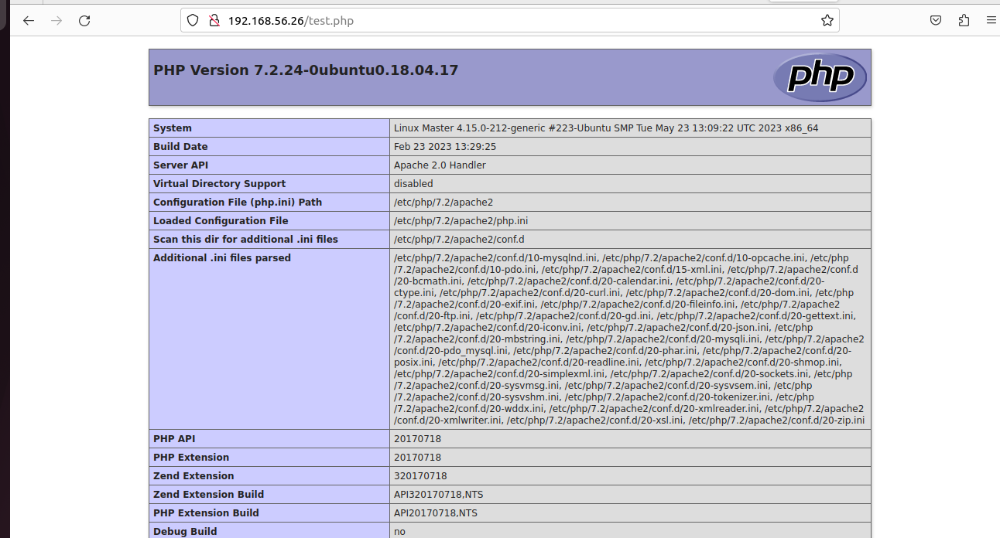

## SUMMARY 
Vagrantfile - This script automates provisioning of two Ubuntu servers, on master a bash script to deploy LAMP

lampstack.sh - What this script does:
1. Updates the packages
2. Install Apache web server
3. Install PHP
4. Install MYSQL
5. Setting Permissions
6. Enabling Modules
7. Cloning Laravel rep from Github


**combined_script.sh**: Contains the LAMP stack setup together with the PHP Configuration

**env_variables.sh**: Adding database credentials.
Adding the APP_ENV key to production since the production and turning the APP_DEBUG key false.

**configure_php.sh**: Installs PHP, opens php.ini file, installs composer and database of Laravel application.

**screenshot** : Proof of tasks

**ansible directory** : Contains ansible playbook and anisible_hosts.

## STEPS TAKEN:
1. Installed Apache - used the sudo apt install apache2 on the script and to confirm it is running on the terminal ```sudo systemctl status apache2```

2. Installed MySQL - Database for the Laravel application.Installed it with  ```sudo apt install MySQL-server``` then to secure it used ```sudo mysql_secure_installation```
   
3. Installed PHP -
   **Note:** You need to install PHP 8 for the composer to work
   
   
5. Laravel Installation -
     clone the Laravel from the GitHub repo
     then install all dependencies needed for the Laravel framework
     create the database for the Laravel project ```sudo mysql -u root -p```
     setting up env file. [screenshots/proof%20.env%20file%20exists.png]
   

   
## ISSUES ENCOUNTERED:
1. Composer error.
     
     Results due to internet/network issues or using the wrong version of PHP.
   
3. Ansible host managed 
  Checking up the ssh authorized public and private key toy uor server.
